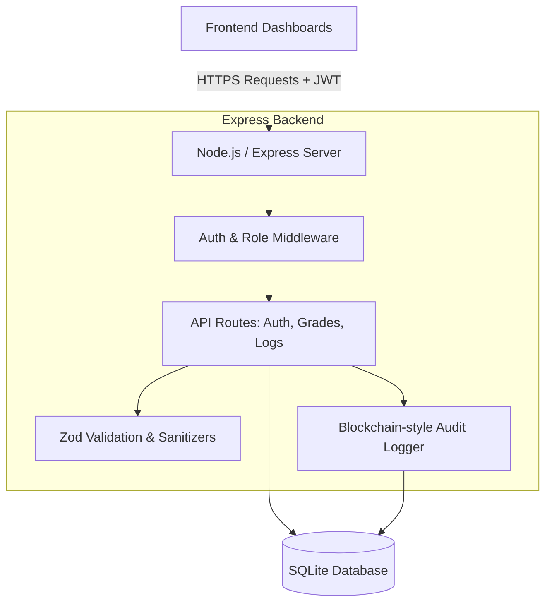

# Secure Grade Vetting System

## Comprehensive Project Breakdown

**Date:** May 2026
**System Goal:** To provide a highly secure, tamper-evident platform for submitting, reviewing, and tracking university student grades to ensure academic integrity and prevent unauthorized modifications.

---

## 1. Technology Stack

The project utilizes a modern, lightweight, and robust stack tailored for security and ease of deployment:

### Backend

- **Runtime:** Node.js
- **Framework:** Express.js
- **Database:** SQLite (via `sqlite` and `sqlite3` driver)
- **Authentication:** JSON Web Tokens (JWT) & `bcryptjs`
- **Security Middlewares:** `helmet` (CSP/Security Headers), `express-rate-limit` (Brute force protection), `cors`.
- **Validation:** `zod` (Strict schema validation)

### Frontend

- **Structure/Logic:** Vanilla HTML5, CSS3, and JavaScript.
- **Design:** Modern CSS variables, glassmorphism, JetBrains Mono & Outfit Google fonts.
- **Dashboards:** Segmented by Role (`index.html`, `instructor-dashboard.html`, `hod-dashboard.html`).

---

## 2. System Architecture

The architecture follows a classic Client-Server model with a strong emphasis on middleware-driven security:

---

## 3. Application Workflow & User Journeys

The system relies heavily on **Role-Based Access Control (RBAC)** to segment workflows between four primary roles: **Student, Instructor, HoD (Head of Department), and Admin**.

### A. Authentication Workflow

1. **Registration:** Users provide their credentials. The backend strictly validates the password complexity using `zod` and hashes the password via `bcrypt` (Cost factor 10) before saving it to the `users` table. An `audit_log` event is recorded.
2. **Login:** User authenticates. The system verifies the bcrypt hash. If successful, it generates a JWT containing the user's `id`, `email`, and `role`, expiring in 1 hour.

### B. Grade Submission Workflow (Instructor)

1. The Instructor fills out the submission form on `instructor-dashboard.html`.
2. The payload (Student Email, Course, Marks, etc.) is sent to `POST /grades` with the Instructor's JWT.
3. **Backend Processing:**
   - Validates the user's role (`Instructor`).
   - Sanitizes all string inputs to prevent XSS.
   - Generates a **Digital Signature** (SHA-256 hash) combining the payload, the instructor's ID, and a timestamp.
   - Stores the grade in a `pending` status.
   - Triggers the Audit Logger to record `GRADE_SUBMITTED`.

### C. Grade Review Workflow (HoD)

1. The HoD views all `pending` grades via `GET /grades`.
2. The HoD can `Approve` or `Reject` a grade (`PATCH /grades/:id`).
3. **Backend Processing:**
   - Verifies the HoD role.
   - Updates the grade status and records the `approved_by` user ID.
   - Triggers the Audit Logger to record `GRADE_STATUS_UPDATED`.

---

## 4. Core Security Mechanisms

Security is the central focus of the system. The following mechanisms have been engineered to ensure data integrity and system resilience:

### 4.1. Tamper-Evident Audit Trails (Immutable Logging)

Every significant action (Login, Register, Grade Submission, Grade Update) is logged in the `audit_logs` table.

- Logs are chained together like a blockchain. Each log entry generates a SHA-256 hash of its payload *combined with the previous log's hash*.
- A separate script (`database/verify_logs.js`) can traverse the database to ensure no log entry was maliciously deleted or modified directly in the database.

### 4.2. XSS & Injection Protection

- **Frontend:** An `escapeHTML()` function sanitizes all dynamic data before it is injected into the DOM via `.innerHTML`, preventing Cross-Site Scripting (XSS).
- **Backend:** A strict input sanitizer strips executable HTML characters (`<, >, ', "`) at the API boundary.

- **Database:** Prepared statements are strictly enforced via the custom DB wrapper (`db.js`), entirely mitigating SQL Injection vectors.

### 4.3. Secure Communications

- The server runs on a manually configured **HTTPS/TLS 1.3 server** (`server.js`) using `cert.pem` and `key.pem`.
- **Helmet Middleware** enforces strict Content Security Policies (CSP).

### 4.4. Rate Limiting

- The `/auth` routes are guarded by `express-rate-limit` (max 50 requests per 15 minutes per IP) to prevent brute-forcing of passwords.

---

## 5. Database Schema Details

The SQLite database (`secure_grade.sqlite`) consists of three primary tables:

1. **`users`**
   - Stores `id` (UUID), `email`, `password_hash`, `role`, and `profile` (JSON block for dynamic metadata like phone numbers or departments).

2. **`grades`**
   - Stores `id` (UUID), `data` (JSON block holding the actual grade data), `signature` (SHA256 signature), `status` (pending/approved/rejected), and relationships (`created_by`, `approved_by`).

3. **`audit_logs`**
   - Stores `id`, `action`, `user_id`, `hash` (Current block hash), `previous_hash` (Linking hash), and `metadata` (JSON details of the event).
